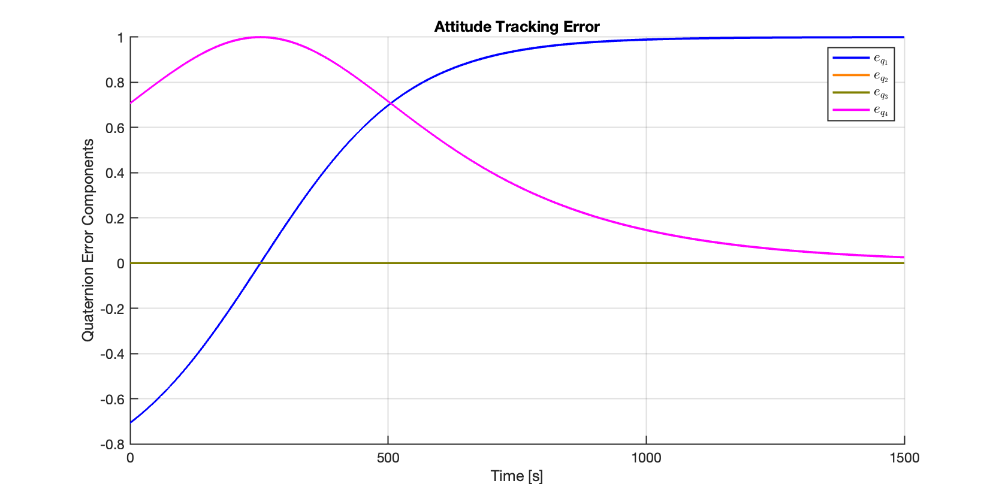

# Quaternion-Based Feedback Control for Satellite Attitude Regulation

This project implements a quaternion-based feedback control system for satellite attitude regulation in 3D space. The system is designed for smooth and stable convergence to a desired orientation, avoiding the singularities associated with Euler angle representations.

## 📌 Objectives
- Model a satellite as a rigid body with full 3D attitude dynamics.
- Implement a feedback controller using quaternion representation.
- Stabilize the satellite's orientation to a specified target attitude.
- Analyze and validate the system through MATLAB/Simulink simulation.

## 🧰 Tools & Methods
- MATLAB 
- Simulink
- Spacecraft kinematics
- Quaternion-based feedback regulator

## 📈 Results
The feedback controller achieves stable convergence to the desired quaternion orientation, with minimal steady-state error and smooth rotational transitions. Simulation plots and system responses are included to illustrate performance.

> The figure above shows the error in quaternion components over time, demonstrating fast and stable convergence to the target attitude.

## 🔗 Related Work
This project is part of my graduate research in **Controls** at the University of Washington’s Department of Aeronautics and Astronautics.

## 📚 Citations

Kim, Y. and Mesbahi, M., 2004. *Quadratically constrained attitude control via semidefinite programming*. IEEE Transactions on Automatic Control, 49(5), pp.731–735.

